# Proyecto 3 — API de Usuarios con PostgreSQL y pgAdmin

API REST de usuarios construida con Node.js y Express, con persistencia en PostgreSQL y administración de la base de datos vía pgAdmin, todo orquestado con Docker Compose.

Proyecto individual desarrollado para la evaluación **"Proyectos Prácticos Finales — Docker, Git y CI/CD"** (Richard Betancur, ADSO — Centro de Tecnología y Manufactura Avanzada, SENA).

## Descripción

El servicio expone un CRUD completo de usuarios (`nombre`, `email`) con validación de datos de entrada y códigos de estado HTTP adecuados (200, 201, 400, 404, 500). La base de datos se inicializa automáticamente al primer arranque mediante un script SQL de migración, y los datos pueden inspeccionarse gráficamente desde pgAdmin.

## Tecnologías

- Node.js + Express
- PostgreSQL 16 (alpine)
- pgAdmin 4
- Docker y Docker Compose
- Make (objetivos de operación)

## Estructura del proyecto

```
proyecto3-api-usuarios/
├── api/
│   ├── src/
│   │   └── index.js
│   ├── package.json
│   ├── package-lock.json
│   ├── Dockerfile
│   └── .dockerignore
├── db/
│   └── init.sql
├── docker-compose.yml
├── .env
├── .env.example
├── .gitignore
├── Makefile
├── evidencias/
└── README.md
```

## Requisitos

- Docker y Docker Compose instalados
- `make` (en Windows: `winget install ezwinports.make`, o usar el equivalente en PowerShell si se documenta un script alterno)

## Variables de entorno

Copiar `.env.example` a `.env` y completar los valores. Variables usadas:

| Variable | Descripción |
|---|---|
| `POSTGRES_DB` | Nombre de la base de datos |
| `POSTGRES_USER` | Usuario de PostgreSQL |
| `POSTGRES_PASSWORD` | Contraseña de PostgreSQL |
| `PGADMIN_DEFAULT_EMAIL` | Correo de acceso a pgAdmin |
| `PGADMIN_DEFAULT_PASSWORD` | Contraseña de acceso a pgAdmin |

## Instrucciones de ejecución

Levantar los tres servicios (API, base de datos, pgAdmin):

```
make up
```

Ver el estado de los contenedores:

```
make ps
```

Probar los endpoints básicos:

```
make test
```

Ver logs de la API:

```
make logs
```

Detener los servicios:

```
make down
```

Detener y borrar el volumen de datos (para forzar que el script de migración se vuelva a ejecutar):

```
make clean
```

La API queda disponible en `http://localhost:3000` y pgAdmin en `http://localhost:5050`.

### Conexión desde pgAdmin

Al registrar el servidor en pgAdmin, usar:

- **Host**: `db` (nombre del servicio en `docker-compose.yml`, no `localhost`)
- **Port**: `5432`
- **Maintenance database**: el valor de `POSTGRES_DB`
- **Username / Password**: los valores de `POSTGRES_USER` / `POSTGRES_PASSWORD`

## Endpoints

| Método | Ruta | Descripción | Códigos de estado |
|---|---|---|---|
| GET | `/api/health` | Verifica conexión a la base de datos | 200, 500 |
| GET | `/api/usuarios` | Lista todos los usuarios | 200, 500 |
| GET | `/api/usuarios/:id` | Obtiene un usuario por id | 200, 404, 500 |
| POST | `/api/usuarios` | Crea un usuario | 201, 400, 500 |
| PUT | `/api/usuarios/:id` | Actualiza un usuario | 200, 400, 404, 500 |
| DELETE | `/api/usuarios/:id` | Elimina un usuario | 200, 404, 500 |

Validaciones en `POST` y `PUT`: `nombre` y `email` son obligatorios, y `email` debe cumplir un formato válido. Un email duplicado devuelve `400`.

### Ejemplos con curl

```
curl http://localhost:3000/api/usuarios

curl -X POST http://localhost:3000/api/usuarios \
  -H "Content-Type: application/json" \
  -d "{\"nombre\":\"Vale Usuga\",\"email\":\"vale.usuga@example.com\"}"

curl -X PUT http://localhost:3000/api/usuarios/4 \
  -H "Content-Type: application/json" \
  -d "{\"nombre\":\"Valeria Usuga\",\"email\":\"valeria.usuga@example.com\"}"

curl -X DELETE http://localhost:3000/api/usuarios/4

curl -i -X POST http://localhost:3000/api/usuarios \
  -H "Content-Type: application/json" \
  -d "{\"nombre\":\"Prueba Mala\",\"email\":\"correo-invalido\"}"

curl -i http://localhost:3000/api/usuarios/9999
```

## Evidencias

Todas las capturas están en la carpeta [`evidencias/`](./evidencias).

### 1. Servicios levantados

`docker compose up -d` con los tres servicios (API, base de datos y pgAdmin):

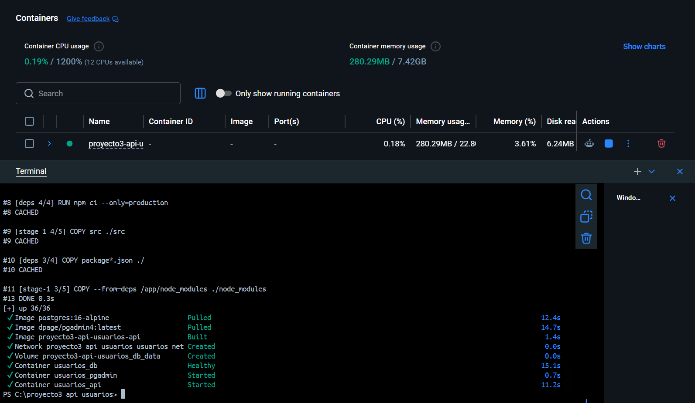

### 2. Contenedores corriendo

`docker compose ps` mostrando los tres contenedores activos:

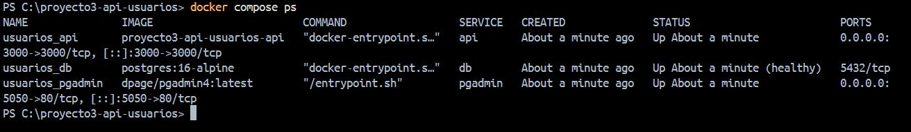

### 3. CRUD completo

Listado de usuarios (GET):

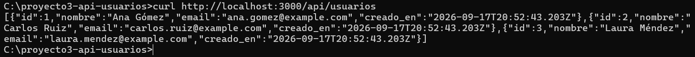

Creación de usuario (POST):

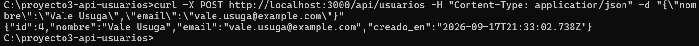

Actualización de usuario (PUT):

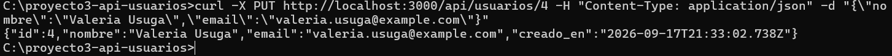

Obtención de usuario por id (GET):

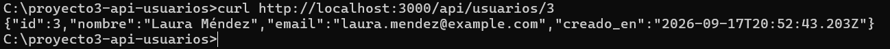

Eliminación de usuario (DELETE):

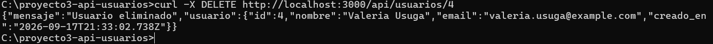

### 4. Validación — POST inválido (400)

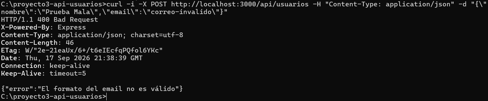

### 5. Recurso inexistente (404)

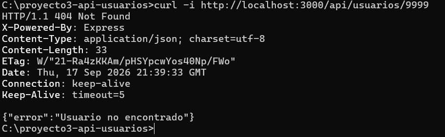

### 6. pgAdmin

Tabla `usuarios` vista desde pgAdmin, reflejando los datos de la API:

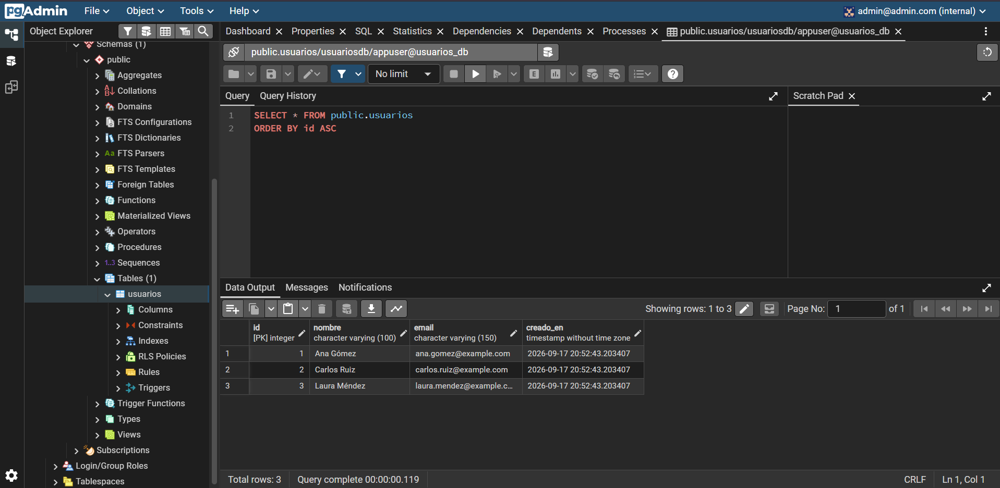

### 7. Makefile en uso

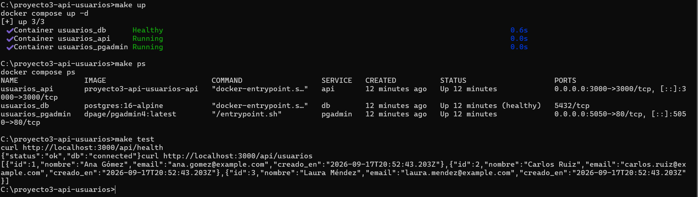

## Preguntas de reflexión

**¿Por qué el script de migración solo se ejecuta la primera vez que se crea el volumen? ¿Qué harías para volver a ejecutarlo?**

La imagen oficial de PostgreSQL solo ejecuta los scripts montados en `/docker-entrypoint-initdb.d/` cuando el volumen de datos está vacío, es decir, la primera vez que se crea el contenedor. Si el volumen ya existe (con datos previos), Postgres asume que la base ya está inicializada y omite el script, para evitar sobrescribir información. Para forzar que vuelva a ejecutarse hay que eliminar el volumen asociado y dejar que se cree desde cero, con `docker compose down -v` (o el objetivo `make clean` de este proyecto) seguido de `docker compose up -d`.

**¿Por qué en pgAdmin el host de conexión es el nombre del servicio y no `localhost`?**

Docker Compose crea una red interna donde cada servicio es accesible por su nombre, gracias a la resolución de DNS interna de Docker. pgAdmin corre en su propio contenedor, con su propia interfaz de red aislada del host; `localhost` desde dentro de ese contenedor apuntaría al propio contenedor de pgAdmin, no al de la base de datos. Por eso la conexión debe hacerse al nombre del servicio (`db`), que Docker resuelve automáticamente a la IP interna del contenedor de PostgreSQL.

**¿Qué ocurre si la API arranca antes de que la base de datos esté lista, y cómo lo previene la configuración del compose?**

Si la API intenta conectarse a PostgreSQL antes de que el motor de base de datos haya terminado de inicializarse, las consultas fallan con errores de conexión rechazada, y el contenedor de la API puede quedar en un estado de error o reiniciarse en bucle. Para prevenirlo, el `docker-compose.yml` define un `healthcheck` en el servicio de base de datos (una verificación periódica de que Postgres acepta conexiones) y usa `depends_on` con la condición `service_healthy` en el servicio de la API, de modo que Compose no arranca la API hasta que el healthcheck de la base de datos reporte que está lista.